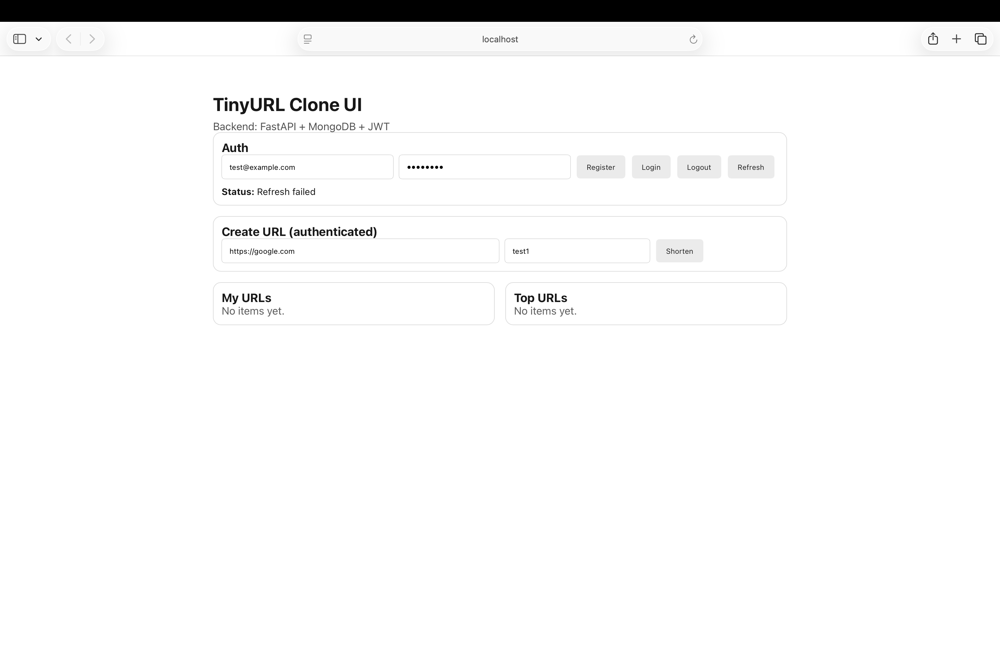

# TinyURL System Design (Full Stack)

A production-style **URL Shortener** built with **FastAPI, MongoDB, Next.js, and Docker**.  
This project demonstrates a complete backend system with authentication, analytics, and a modern frontend UI.

---

## Demo



---

## Features

### URL Shortening
- Generate short URLs for long links
- Custom short codes supported
- Automatic unique code generation

### Authentication
- JWT-based authentication
- Register / Login system
- Authenticated URL creation

### Analytics
- Track click counts
- Track last click timestamp
- View most popular links

### User Dashboard
- List user-created URLs
- Top-performing links
- Click analytics

### Infrastructure
- Dockerized full stack
- FastAPI backend
- MongoDB database
- Next.js frontend

---

## Architecture

```

Browser
│
▼
Next.js Frontend
│
▼
FastAPI Backend (REST API)
│
▼
MongoDB Database

```

---

## Tech Stack

### Backend
- FastAPI
- PyMongo / Motor
- JWT Authentication
- Pydantic
- Docker

### Frontend
- Next.js
- React
- TypeScript

### Database
- MongoDB

### Infrastructure
- Docker
- Docker Compose

---

## Project Structure

```

url-shortener-system-design
│
├── app/                 # FastAPI backend
│   ├── routes
│   ├── auth
│   ├── schemas
│   ├── utils
│   └── database.py
│
├── tinyurl-ui/          # Next.js frontend
│
├── Dockerfile.backend
├── docker-compose.yml
├── requirements.txt
└── README.md

```

---

## Running the Project

### 1️⃣ Clone the repository

```

git clone [https://github.com/varad-suryavanshi/url-shortener-system-design.git](https://github.com/varad-suryavanshi/url-shortener-system-design.git)
cd url-shortener-system-design

```

### 2️⃣ Start services

```

docker compose up --build

```

### 3️⃣ Open the app

Frontend

```

[http://localhost:3000](http://localhost:3000)

```

Backend API Docs

```

[http://localhost:8000/docs](http://localhost:8000/docs)

```

---

## API Endpoints

### Authentication

```

POST /auth/register
POST /auth/login
GET  /me

```

### URL Shortening

```

POST /shorten
POST /me/shorten

```

### Redirect

```

GET /r/{short_code}

```

### Analytics

```

GET /stats/{short_code}
GET /me/urls
GET /me/top

```

---

## Example Flow

1. Register user
2. Login to receive JWT
3. Create short URL
4. Share the short link
5. Track analytics

---

## Example Short URL

```

[http://localhost:8000/r/test123](http://localhost:8000/r/test123)

```

Redirects to the original URL and increments click count.

---

## Future Improvements

- Redis caching
- Rate limiting
- Link expiration
- Geo-location analytics
- Kubernetes deployment
- Cloud deployment (AWS / GCP)

---

## Author

Varad Suryavanshi  
MS Computer Science – NYU Courant

GitHub:  
https://github.com/varad-suryavanshi


